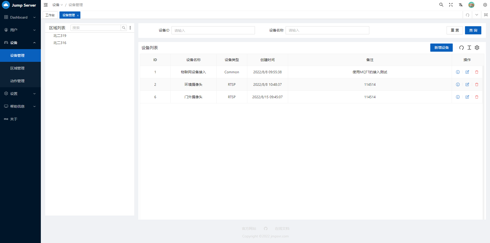

<div align="center">
  <a href="https://github.com/jmpsvr/jmpsvr">
    
  </a>
  <br><br>
</div>

**English** | [中文](./README.zh-CN.md)

[Documentation](https://docs.jmpsvr.com) | [API Documentation](https://docs.jmpsvr.com/api.html)

## Introduction

Jump Server is an elegant and open-source fortress of the Internet of things. It has the following characteristics:

* 💡 One click deployment: one click deployment based on container technology
* ⚡️ Lightweight and fast: Node.js, Vue3
* 🛠️ Quick start: low learning cost, easy to start in a short time
* 🔑 Fine grained permission management: support setting permissions independently for each user
* 📦 Secondary development: it is highly scalable and can access new equipment through secondary development
* 🔩 Video surveillance: suitable for most video surveillance equipment in the market

## Deployment
> The container of this project is based on Docker, and the container is arranged in docker-compose. Please confirm the configuration of the environment before deployment.
>
> Ports 80 and 1883 are required for deployment. Please make sure they are idle. If you need to modify the port, you can edit docker-compose.yaml by yourself.

Execute the following command to complete the deployment:
```bash
git clone https://github.com/jmpsvr/jmpsvr && cd jmpsvr
docker-compose up -d
```
Access after completion http://localhost. The default administrator username and password are `admin`.
## Structure


## Preview





## Maintainer

[@mmdjiji](https://github.com/mmdjiji)

## Sponsor


## License

[GPL-3.0](./LICENSE)
