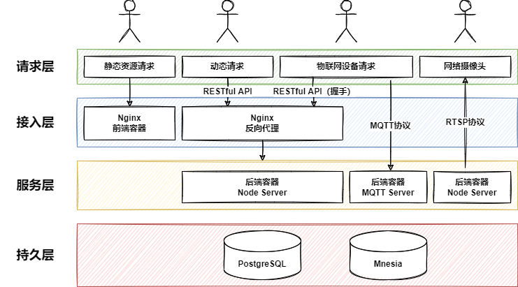
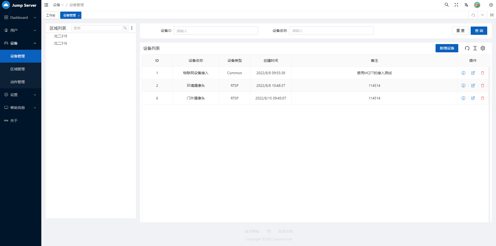
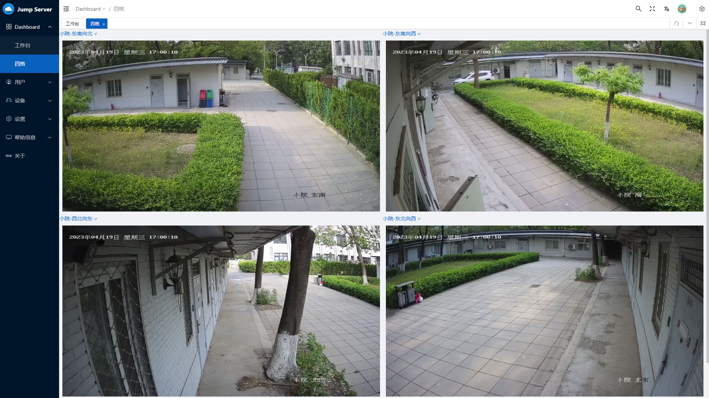
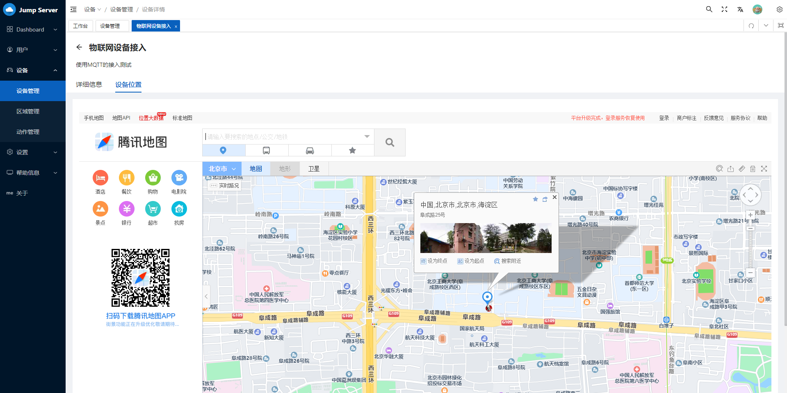

  
    

[English](./README.md) | **中文**

## 简介

Jump Server 是一个优雅而开源的物联网堡垒机，它有以下特性:

* 💡 一键部署：基于容器化技术，傻瓜式一键部署
* ⚡️ 轻量而快速：后端采用 Node.js，前端采用 Vue3
* 🛠️ 快速上手：学习成本低，容易短时间上手
* 🔑 细粒度权限管理：支持为每个用户独立设置权限
* 📦 二次开发：可扩展性强，可通过二次开发接入新的设备
* 🔩 视频监控：适配市场上绝大多数的视频监控设备

## 架构图

## 预览

## 维护者

[@mmdjiji](https://github.com/mmdjiji)

## 赞助

## 开源协议

[GPL-3.0](./LICENSE)
